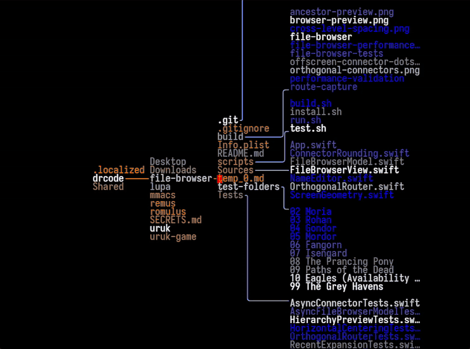

# lupasta

A desktop file browser that draws your filesystem as a single horizontal path instead of a
tree view. Each column lists the siblings of one folder on the path to the current selection;
the next columns preview what is inside the neighbouring folders. Everything is monospace text
on black, joined by orthogonal connectors.



Text colour encodes age, not file type: names modified recently are white and fade through
grey towards orange (on the selection path) or blue (in the previews) as they get older.

Written in Rust with [GPUI](https://gpui.rs), the GPU-accelerated UI framework behind Zed.
Up to v0.1.0 it was a Tauri 2 + Svelte 5 app; the port to GPUI keeps the same layout, colours and
behaviour (a test checks the geometry against the old TypeScript code) in one process using about
a fifth of the memory. It is developed on Windows; CI builds and tests it on Windows, macOS and
Linux.

## Running it

You need a stable Rust toolchain, 1.97 or newer. On Linux, GPUI also needs
`libxkbcommon-x11-dev`, `libwayland-dev`, `libx11-xcb-dev`, `libfontconfig-dev` and a Vulkan
driver.

```sh
cargo run                          # opens the folder that contains your home directory
cargo run --example fixture        # writes the synthetic fixture used by the tests
cargo run -- --root fixtures/visual/Users --select drcode/file-browser/temp_0.md
cargo build --release
```

Release builds of GPUI's Windows backend precompile their shaders with `fxc.exe` from the
Windows SDK. Without the SDK, `cargo build --profile local` gives an optimized build that
compiles them at start-up instead. Without the Visual Studio build tools you can use the GNU
toolchain for this folder only (`rustup override set stable-x86_64-pc-windows-gnu`); it needs a
MinGW gcc and `windres` on `PATH` for the bundled SQLite and the icon, which
[WinLibs](https://winlibs.com) provides (`winget install BrechtSanders.WinLibs.POSIX.MSVCRT`).

The executable takes `--root <dir>` and `--select <path relative to root>`, plus `--data-dir`,
`--no-index`, `--no-gitignore` and `--smoke`. With no arguments it reopens the last place you
were in, or the parent of your home directory with the home directory selected.

## Using it

| Key | Action |
|---|---|
| `↑` `↓` | move within the column (also the mouse wheel) |
| `→` `Space` | enter the selected folder |
| `←` | back to the parent; on a top-level entry, go up to the folder above the root |
| `Enter` | enter a folder, open a file with the default application |
| `/` or `Ctrl+K` | search |
| `Ctrl+C` | copy the full path of the selection |
| `Ctrl+E` | show the selection in Explorer / Finder / the file manager |
| `Ctrl+H` | show or hide hidden files |
| `Ctrl+O` | open another folder |
| `Ctrl+=` `Ctrl+-` `Ctrl+0` | zoom |
| `Ctrl+,` | settings |
| `Esc` | close search or settings |

Clicking any name, including names in the preview columns, selects it; double-clicking a file
opens it. Moving the pointer to the top edge reveals a bar with the current folder, search and
settings.

Settings are kept in `settings.json` in the app data folder: colour by age or by kind and how
old the oldest colour is, font (Iosevka, JetBrains Mono, IBM Plex Mono or the system monospace,
each sized to the same 10 px cell so the layout does not change), zoom, animation speed,
truncation, a status line with the selection's size and age, hidden files, sort order, folders
first, wheel speed, reopening the last place, recent folders, and what the search index skips.
The window's size and position are kept next to them. "Check for updates" asks GitHub for the
latest release and links to it; nothing is downloaded or installed automatically. Settings and
the search index from the Tauri builds are read as they are.

Search is fuzzy and matches names and paths: `rtr` finds `OrthogonalRouter.swift`,
`mordor roster` finds `05 Mordor/Orc shift roster.csv`. Picking a result opens the path to it.

## How it works

The core owns the filesystem. The UI only ever passes paths relative to the root, and every one
is normalised and checked against the root after resolving symlinks, so `..`, drive letters,
UNC paths and junctions that point outside are refused. Listing a folder reads that one folder;
there is no recursive traversal on the UI side.

A background thread walks the root in parallel and keeps a SQLite index (with an FTS5 trigram
index on names), synced on later launches by diffing against what is already stored. A
filesystem watcher coalesces bursts of events and updates the index, the search corpus and
any folder that is on screen. Search takes name candidates from FTS5 and falls back to a
parallel fuzzy scan (nucleo) over all paths held in memory.

The window keeps a lazy model of the folders it has listed and turns it into a layout with a
pure function; connectors are routed from that geometry on every animation frame, so moving the
selection interpolates the whole scene instead of re-rendering it. Only rows near the focus line
are laid out, which keeps a 20,000-entry folder responsive. Each frame becomes a display list
(text runs, quads, connector paths) painted by a single GPUI canvas; the top bar, search and
settings are drawn in the same monospace cells and hit-tested from the geometry that was drawn.
Listings, searches and index work run off the UI thread and report back through a channel.

```
src/
  filesystem.rs index.rs search.rs watcher.rs settings.rs update.rs   the core
  session.rs      one root: index lifecycle, watcher, listings
  tree.rs controller.rs              folder model and navigation, no IO
  layout.rs router.rs animator.rs    the scene, pure
  palette.rs metrics.rs prefs.rs     colours, geometry, settings rows
  ui/             GPUI: the window, painting, overlays, fonts, text input
```

Everything outside `ui/` is plain Rust and covered by `cargo test`. GPUI comes from crates.io as
the `gpui-pre` 0.3.7 snapshot of Zed (the official `gpui` crate there is still 0.2.2), pinned
exactly because its API moves with Zed.

The layout and colour rules were measured from a screen recording of someone else's macOS
prototype; [docs/design.md](docs/design.md) explains what was measured and where this
implementation differs.

## Tests

```sh
cargo test                                            # unit tests, layout sweep, golden geometry
cargo run --example fixture && cargo build
target/debug/lupasta --smoke --root fixtures/visual/Users
```

`--smoke` runs the real app once and exits 0 only if it laid out the tree, indexed it, found an
entry by search and has a working filesystem watcher; CI runs it on all three platforms.

The sweep test lays out every possible selection in the fixture and checks that no names
overlap and no connector crosses another or runs through text. The golden test compares every
name position and every connector, for each of the 164 selections, with what the TypeScript
implementation of v0.1.0 computed (`tests/golden/layout.json`; `scripts/golden.ts` regenerates
it from a v0.1.0 checkout).

## Releases

Pushing a tag such as `v0.2.0` (matching the version in `Cargo.toml`) builds a Windows zip, a
universal macOS `.app` and a Linux tarball into a draft GitHub release. The builds are not
code-signed, so SmartScreen and Gatekeeper will warn on first launch.

## Performance

On a 500,000-entry tree, searching takes under 45 ms. Moving through a 20,000-entry folder costs
about 3 ms of layout and connector routing per keystroke. The whole app uses about 70 MB, where
the Tauri build used about 380 MB across seven processes, mostly WebView2. The numbers and how to
reproduce them are in [docs/benchmarks.md](docs/benchmarks.md).

## Limitations

- When a long name sits where connectors need to pass, the preview column is pushed right
  rather than routed around the name as tightly as the original does.
- Width is computed in terminal cells, so names in scripts that need a fallback font (CJK,
  emoji) are only approximately aligned.
- Text input takes typed characters, dead keys and committed IME text, but does not show an IME
  composition in progress, and the search prompt has no text selection.
- There is no screenshot-comparison end-to-end suite any more (the Tauri build drove WebView2
  for it); the smoke run and the golden geometry test cover the app and the scene logic.
- `.git`, `node_modules`, `target` and `AppData` are browsable but not indexed for search (the
  list is editable in settings).
- Live updates watch the whole root recursively. On Linux a large root can exceed the inotify
  watch limit (`fs.inotify.max_user_watches`); browsing still works and settings say so. On
  macOS, indexing a home folder triggers the system prompts for Desktop, Documents and Downloads.

## License

MIT. The bundled fonts (Iosevka, JetBrains Mono, IBM Plex Mono) are under the SIL Open Font
License; see `assets/fonts`.
